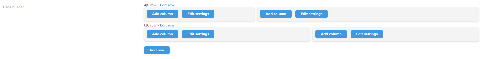

# Nova CMS

Nova CMS is a package that makes Laravel Nova into a functional CMS to make pages easily editable. This package is for public usage, all suggestions are welcome.

## In development

This package is in development

## Development Roadmap v1.0

### Migrations
- [ ] **NovaPages** 
    - Tablename: 'nova_pages'
    - Required fields:
        - `ID`
        - `title` (nullable)
        - `slug` (required, unique)
        - `order` (integer, nullable, default=0)
        - `resource` (varchar, nullable, default=null)
        - `resource_id` (integer, nullable, default=0)
    
- [ ] **NovaPageBlocks** 
    - Tablename: 'nova_page_blocks'
    - Required fields:
        - `ID`
        - `page_id`
        - `type` (varchar, required)
        - `content` (bigText)
        - `order` (integer, nullable, default=0)
    
- [ ] **NovaPageBlockSettings**
    - Tablename: 'nova_page_block_settings'
    - Required fields:
        - `ID`
        - `page_block_id`
        - `name` (required)
        - `value` (bigText)

### Farcades

- **Farcades/Page**
    - [ ] `Page::get(string|int $identifier)` - Get PageBlock collection of specific page
    - [ ] `Page::show(string|int $identifier)` - Print function to render specific page content
    
- **Farcades/PageBlock**
    - [ ] `PageBlock::get(int $pageId, string|int $pageBlockIdentifier)` - Get a specific PageBlock object
    - [ ] `PageBlock::show(int $pageId, string|int $pageBlockIdentifier)` - Print function to render a specific page block without the columns

### Controllers

- [ ] **Controllers/PageController**
- [ ] **Controllers/PageBlockController**
- [ ] **Controllers/PageBlockContentController**
- [ ] **Controllers/PageBlockSettingController**

### Front-end

- [ ] **Component for the `PageBuilder::make()` field**
- [ ] **Component for the `PageBlockBuilder::make()` field**
- [ ] **Component for a popup to add a row to the content of the Page**
- [ ] **Component for a popup to select one of the configured PageBlock types**
- [ ] **Component for a popup to add a column**
- [ ] **Component for a popup to manage the row settings like the grid**
- [ ] **Component for a popup to edit an existing row**
- [ ] **Component for a popup to edit an existing column**

### Configuration

- [ ] New configuration file: `config/pages.php`
- [ ] New configuration file: `config/page-blocks.php`
